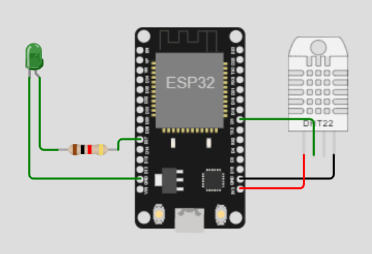
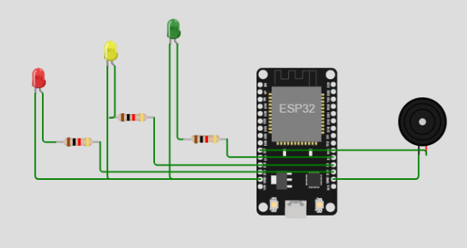

# PA_IOT

## Nama dan NIM anggota kelompok
- Vigo Santri Ali       2009106008
- Riska Nurliyanti      2009106017
- Sulhairah             2009106026
- Cantika Fitri Ayu. D  2009106045

## Judul Projek Akhir
MONITORING DAN KONTROLING KUALITAS UDARA DIDALAM RUANGAN DENGAN PLATFORM BLYNK

## Deskripsi
sistem ini untuk memonitoring dan kontroling kualitas udara dengan menggunakan platform blynk sebagai kontroling dan monitoring,
Iot MQTT Panel sebagai kontroling dan monitoring, dan Blynk sebagai Monitoring.

## Pembagian Tugas per Individu
- Publisher = vigo santri ali dan sulhairah
- Subscriber = riska nurliyanti dan cantika fitri ayu
- Kodular (design) = cantika fitri ayu
- Kodular (blocks) = riska nurliyanti
- Blynk = sulhairah
- Mqtt control panel = vigo santri ali

## Komponen yang Digunakan
- breadboard
- esp32
- dht22
- buzzer
- kabel jumper
- resistor
- LED
-
## Board Schematic 
berikut adalah foto rangkaian publisher dan subscriber dirancang menggunakan Wokwi

  

  

